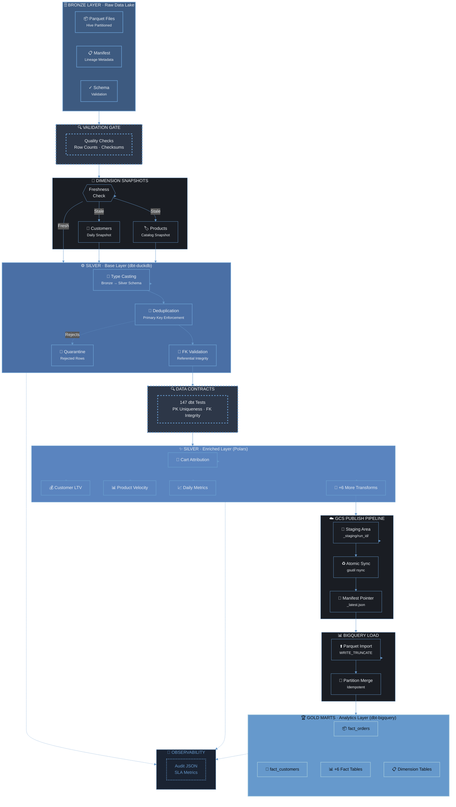
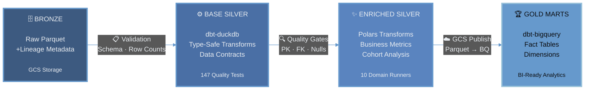

# Visual Assets Creation Guide for Pipelines Modal

This guide provides step-by-step instructions and code snippets for creating visual assets to enhance the ecom_datalake_pipelines modal.

---

## 1. Architecture Diagram (Mermaid → PNG)

### Step 1: Copy Mermaid Code (Styled for Portfolio)

**Version 1: Detailed Flow (Recommended)**



**Version 2: Simplified High-Level (Alternative - Blue Gradient)**



### Step 2: Render to PNG

1. Go to https://mermaid.live
2. Paste the code above into the editor
3. Adjust the diagram if needed
4. Click "Actions" → "PNG" to download
5. Save as: `img/projects/pipelines_architecture_flow.png`

**Recommended settings:**
- Width: ~1200-1400px
- Transparent background: No (use white)
- Scale: 2x for retina displays

---

## 2. Airflow DAG Screenshot

### Steps:

1. Navigate to the pipelines repo:
   ```bash
   cd /Users/garrettschumacher/Documents/git_repos/ecom_datalake_pipelines
   ```

2. Start Airflow:
   ```bash
   make up
   ```

3. Wait for Airflow to initialize (~30-60 seconds)

4. Open browser to: http://localhost:8080

5. Login credentials:
   - Username: `airflow`
   - Password: `airflow`

6. Find and click on the `ecom_silver_to_gold` DAG

7. Click the "Graph" view tab

8. Take a screenshot showing:
   - The full DAG graph
   - The 10 parallel enriched transform tasks
   - Task dependencies and flow

9. Save screenshot as: `img/projects/pipelines_airflow_dag.png`

10. Stop Airflow when done:
    ```bash
    make down
    ```

**Screenshot tips:**
- Use full-screen browser for clean capture
- Hide browser toolbars (Cmd+Shift+F on Mac)
- Zoom to fit entire graph in view
- Use macOS Screenshot tool (Cmd+Shift+4) for precision

---

## 3. dbt Lineage Graph Screenshot

### Steps:

1. Navigate to the dbt project:
   ```bash
   cd /Users/garrettschumacher/Documents/git_repos/ecom_datalake_pipelines/dbt_duckdb
   ```

2. Generate dbt documentation:
   ```bash
   dbt docs generate
   ```

3. Serve the documentation:
   ```bash
   dbt docs serve
   ```

4. Browser will auto-open to http://localhost:8080 (or displayed port)

5. In the left sidebar, click on a key model:
   - Recommended: `base_silver__orders`
   - Alternative: `stg_orders` or `int_customer_ltv`

6. The lineage graph will appear showing:
   - Upstream dependencies
   - Downstream models
   - Data flow

7. Take a screenshot of the lineage graph

8. Save as: `img/projects/pipelines_dbt_lineage.png`

9. Stop the server (Ctrl+C in terminal)

**Screenshot tips:**
- Click the model name to center the graph
- Use the zoom controls to fit the relevant portion
- Include the model name in the screenshot for context

---

## 4. Terminal Demo (Optional - GIF/Video)

### Using QuickTime (Built-in Mac):

1. Open QuickTime Player
2. File → New Screen Recording
3. Select portion of screen (terminal window)
4. Navigate to pipelines repo:
   ```bash
   cd /Users/garrettschumacher/Documents/git_repos/ecom_datalake_pipelines
   ```
5. Start recording
6. Run the demo:
   ```bash
   make local-demo-fast
   ```
7. Let it run for ~2 minutes showing:
   - Bronze profiling
   - Silver transformations
   - Validation passes
   - Files created
8. Stop recording (Cmd+Control+Esc)
9. Save video as MOV

### Convert to GIF:

**Option 1 - ezgif.com (easiest):**
1. Go to https://ezgif.com/video-to-gif
2. Upload the MOV file
3. Set frame rate: 10 fps
4. Set size: 800px width
5. Convert and download
6. Optimize GIF: https://ezgif.com/optimize
7. Save as: `img/projects/pipelines_demo.gif`

**Option 2 - Kap (free app):**
1. Download Kap from https://getkap.co
2. Select terminal window
3. Record demo
4. Export as GIF (built-in optimizer)
5. Save as: `img/projects/pipelines_demo.gif`

**Target specs:**
- File size: <5MB
- Width: 800-1000px
- Frame rate: 10-15 fps
- Duration: 30-120 seconds

---

## 5. Validation Report Screenshot (Optional)

### Steps:

1. After running `make local-demo-fast`, check for generated reports:
   ```bash
   ls docs/validation_reports/
   ```

2. If reports exist, view one:
   ```bash
   cat docs/validation_reports/bronze_validation_*.json
   # or
   open docs/data/BRONZE_PROFILE_REPORT.md
   ```

3. Take a screenshot showing:
   - Quality gate passes
   - Table counts
   - Schema validation results
   - Data quality metrics

4. Save as: `img/projects/pipelines_validation_report.png`

**Alternative:** Render the markdown report in a viewer and screenshot the formatted output

---

## 6. Update Modal with Images

Once you have the images, update `files/modals/ecom_pipelines_summary.html`:

### Add after "Medallion Architecture" section:

```html
<h2>System Architecture</h2>

<p class="muted">Complete data flow showing dimension snapshots, validation gates, and GCS/BigQuery integration.</p>
```

### Add after "Key Features" section:

```html
<h2>Orchestration</h2>

<p class="muted">Airflow DAG showing 10 parallel Polars transforms with automatic dependency resolution.</p>

<h2>Data Quality Framework</h2>

<p class="muted">dbt model lineage with 147 data quality tests enforcing contracts at every transformation stage.</p>
```

### Add before "Links" section (if you created the GIF):

```html
<h2>Live Demo</h2>

<p class="muted">2-minute local demo showing Bronze profiling, Silver transformation, and quality validation.</p>
```

---

## Quick Checklist

- [ ] Render Mermaid diagram at mermaid.live → save as `pipelines_architecture_flow.png`
- [ ] Run `make up`, screenshot Airflow DAG → save as `pipelines_airflow_dag.png`
- [ ] Run `dbt docs serve`, screenshot lineage → save as `pipelines_dbt_lineage.png`
- [ ] (Optional) Record terminal demo → convert to GIF → save as `pipelines_demo.gif`
- [ ] (Optional) Screenshot validation report → save as `pipelines_validation_report.png`
- [ ] Update `ecom_pipelines_summary.html` with image sections
- [ ] Test modal loads correctly with all images
- [ ] Optimize images (<500KB each if possible)

---

## Image Optimization Tips

If images are too large:

**PNG Compression:**
```bash
# Using ImageOptim (Mac app - drag and drop)
# or online: https://tinypng.com

# Command line (if you have pngcrush):
pngcrush -brute input.png output.png
```

**Convert to WebP (better compression):**
```bash
# If you have cwebp installed:
cwebp -q 80 input.png -o output.webp

# Update HTML to use WebP with PNG fallback:
<picture>
  <source srcset="../../img/projects/pipelines_architecture_flow.webp" type="image/webp">
  
</picture>
```

---

**Good luck! These visual assets will make your modal much more engaging and help tell the technical story of your medallion lakehouse pipeline.**
