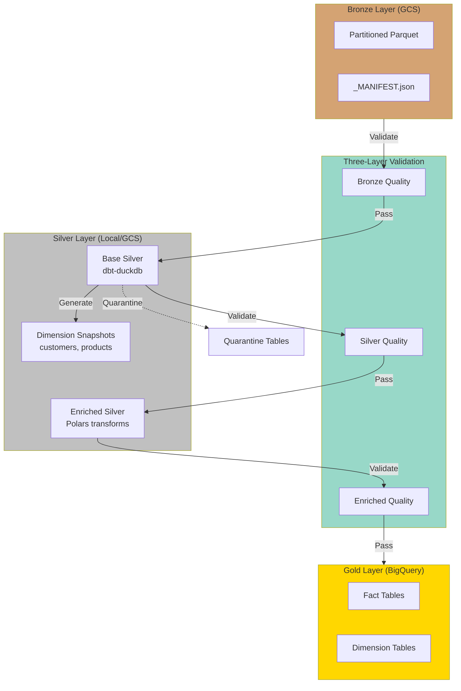
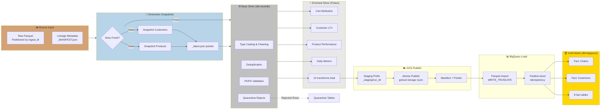
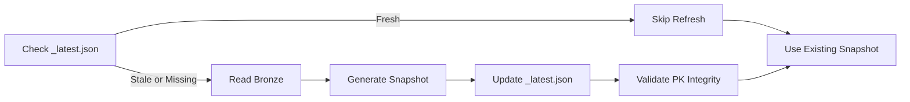
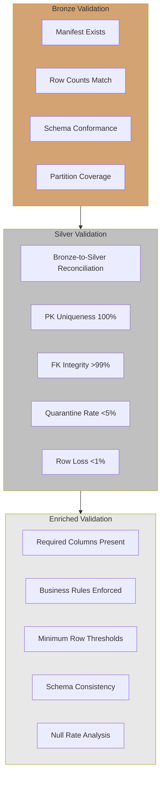
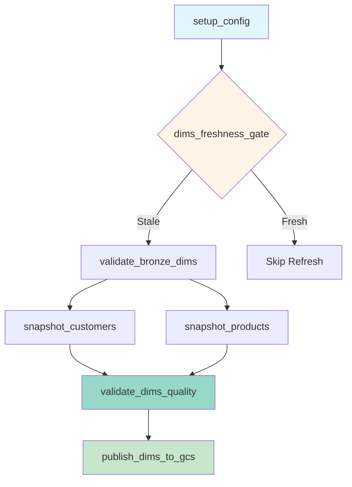
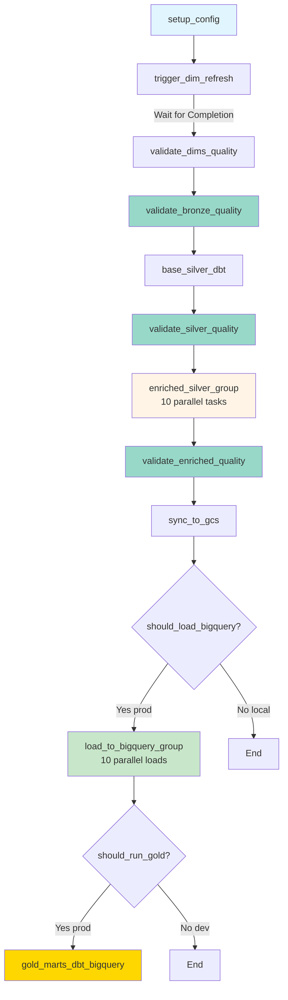
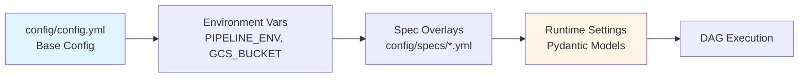
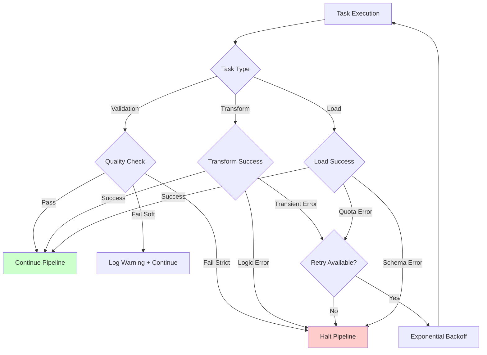

# Architecture Overview

## System Architecture

This document describes the complete architecture of the medallion lakehouse pipeline, from Bronze ingestion through Gold mart serving.

---

## High-Level Data Flow



---

## Detailed Pipeline Flow



---

## Key Architectural Components

### 1. Bronze Layer

**Technology**: Parquet files in GCS
**Partitioning**: Hive-style by `ingest_dt=YYYY-MM-DD`
**Metadata**: `_MANIFEST.json` per partition with row counts and file inventory

**Structure**:
```
gs://bucket/bronze/
  orders/
    ingest_dt=2025-10-15/
      batch_001.parquet
      batch_002.parquet
      _MANIFEST.json
  customers/
    ingest_dt=2025-10-15/
      batch_001.parquet
      _MANIFEST.json
```

**Key Features**:
- Immutable source of truth
- Full lineage metadata
- Schema validation at ingestion
- Supports both batch and incremental patterns

---

### 2. Dimension Snapshot Pattern

**Purpose**: Daily snapshots of slowly-changing dimensions (customers, product_catalog) to avoid re-reading Bronze for every transform.

**Technology**: Parquet snapshots in GCS/local
**Partitioning**: By `snapshot_dt=YYYY-MM-DD`
**Freshness Gate**: `_latest.json` pointer tracks most recent snapshot

**Flow**:


**Benefits**:
- 60% reduction in Bronze reads
- Faster DAG execution
- Prevents stale dimension joins
- Lightweight validation (no Bronze comparison needed)

**Structure**:
```
data/silver/dims/
  customers/
    snapshot_dt=2025-10-15/
      snapshot.parquet
      _MANIFEST.json
  product_catalog/
    snapshot_dt=2025-10-15/
      snapshot.parquet
  _latest.json  # {"customers": "2025-10-15", "product_catalog": "2025-10-15"}
```

---

### 3. Base Silver (dbt-duckdb)

**Purpose**: Type-safe, integrity-checked staging tables
**Technology**: dbt with DuckDB adapter
**Output**: Parquet files partitioned by `ingestion_dt`

**Transformation Layers**:
1. **Ephemeral Scoring** (`int_*_scored.sql`): Shared validation logic
2. **Final Models** (`stg_*.sql`): Deduplicated, typed, validated tables
3. **Quarantine** (`quarantine_*.sql`): Rejected rows with reasons

**Key Features**:
- Consistent `ingestion_dt` metadata across all tables
- PK/FK validation with soft failures (quarantine)
- Shared scoring logic via ephemeral CTEs
- Idempotent with `incremental` materialization support

**Example Model**:
```sql
-- models/base_silver/stg_orders.sql
WITH scored AS (
  SELECT * FROM {{ ref('int_orders_scored') }}
),
deduplicated AS (
  SELECT * FROM scored
  WHERE row_num = 1 AND is_valid = true
)
SELECT
  *,
  {{ get_ingestion_dt() }} AS ingestion_dt
FROM deduplicated
```

---

### 4. Enriched Silver (Polars)

**Purpose**: Pre-computed behavioral attributes and analytics
**Technology**: Pure Polars transforms with I/O wrappers
**Output**: Parquet files partitioned by `ingestion_dt`

**Transform Categories**:
1. **Customer Analytics**: LTV, retention signals, segments
2. **Product Analytics**: Performance metrics, sales velocity
3. **Operational Analytics**: Inventory risk, shipping economics
4. **Attribution**: Cart-to-purchase, touchpoint analysis
5. **Business Metrics**: Daily aggregations, financial rollups

**10 Transforms**:
- `cart_attribution` - Links purchases to cart sessions
- `customer_lifetime_value` - CLV calculation with cohort analysis
- `customer_retention_signals` - Churn risk and engagement scores
- `inventory_risk` - Stock-out prediction and over-stock flags
- `product_performance` - Product-level KPIs
- `sales_velocity` - Time-series product demand forecasting
- `regional_financials` - Geographic revenue rollups
- `daily_business_metrics` - Daily operational dashboard data
- `shipping_economics` - Fulfillment cost analysis
- `attributed_purchases` - Purchase-level attribution

**Key Features**:
- 7x faster than dbt-BigQuery Python models
- ~$200/month cost savings vs warehouse execution
- Lazy evaluation for memory efficiency
- Testable pure functions

**Runner Pattern**:
```python
# src/runners/enriched/customer.py
from src.transforms.customer_ltv import compute_customer_ltv

def run_customer_ltv(ingest_dt: str, base_path: str, output_path: str):
    # I/O wrapper
    df_orders = pl.scan_parquet(f"{base_path}/orders/ingestion_dt={ingest_dt}/*.parquet")
    df_customers = pl.scan_parquet(f"{base_path}/customers/ingestion_dt={ingest_dt}/*.parquet")

    # Pure transform logic
    result = compute_customer_ltv(df_orders, df_customers)

    # Write output
    result.collect().write_parquet(f"{output_path}/customer_lifetime_value/ingestion_dt={ingest_dt}/data.parquet")
```

---

### 5. Three-Layer Validation Framework

**Purpose**: Fail-fast quality gates at each transformation stage



**Validation Modules**:
- `src.validation.bronze_quality` - Manifest and schema validation
- `src.validation.silver` - Row reconciliation and integrity checks
- `src.validation.enriched` - Business rule enforcement
- `src.validation.dims_snapshot` - Dimension quality gate (no Bronze comparison)

**Enforcement Modes**:
- **Warning-only** (local dev): Log issues, exit 0
- **Strict** (CI/CD, prod): Fail pipeline on quality breaches

---

### 6. Staging Prefix Pattern (GCS Publish)

**Purpose**: Atomic publishes to GCS with rollback capability

**Pattern**:
```
1. Transform locally → data/silver/enriched/
2. Sync to staging → gs://bucket/enriched/_staging/run_abc123/
3. Write manifest → gs://bucket/enriched/_staging/run_abc123/_MANIFEST.json
4. Atomic publish → Update _latest.json pointer
```

**Benefits**:
- Atomic publishes (no partial data visible)
- Versioned run folders enable rollback
- Manifest validation before publish
- Production-grade reliability

**Implementation**:
```bash
# src/runners/base_silver.py
SILVER_PUBLISH_MODE=staging

# Sync to staging prefix
gcloud storage rsync data/silver/base/ gs://bucket/silver/_staging/${RUN_ID}/ --recursive

# Write manifest
echo '{"run_id": "...", "tables": [...]}' > _MANIFEST.json

# Atomic publish (update pointer)
echo '{"latest_run": "run_abc123"}' > gs://bucket/silver/_latest.json
```

---

## Airflow DAG Architecture

### DAG 1: `ecom_dim_refresh_pipeline`

**Purpose**: Refresh dimension snapshots independently



**Key Features**:
- Freshness gate skips unnecessary work
- Parallel customer/product snapshots
- Lightweight validation (PK integrity only)
- Can run independently or triggered by main DAG

---

### DAG 2: `ecom_silver_to_gold_pipeline`

**Purpose**: Full pipeline from Bronze → Gold



**Task Groups**:

**Enriched Silver** (Parallel execution):
- `int_cart_attribution`
- `int_customer_lifetime_value`
- `int_customer_retention_signals`
- `int_inventory_risk`
- `int_product_performance`
- `int_sales_velocity`
- `int_regional_financials`
- `int_daily_business_metrics`
- `int_shipping_economics`
- `int_attributed_purchases`

**BigQuery Load** (Parallel execution):
- Dynamic task generation from spec
- Partition-level `WRITE_TRUNCATE`
- Idempotent loads

---

## Spec-Driven Orchestration

**Purpose**: Single source of truth for pipeline metadata

**Spec Structure** (`config/specs/base.yml`):
```yaml
base_silver:
  tables:
    - name: orders
      partition_key: ingestion_dt
      primary_key: [order_id]
      foreign_keys:
        - column: customer_id
          references: customers.customer_id
    - name: customers
      partition_key: ingestion_dt
      primary_key: [customer_id]

dims:
  - name: customers
    snapshot_partition_key: snapshot_dt
    primary_key: [customer_id]
    freshness_hours: 24
  - name: product_catalog
    snapshot_partition_key: snapshot_dt
    primary_key: [product_id]
    freshness_hours: 24

enriched_silver:
  transforms:
    - name: cart_attribution
      depends_on: [orders, shopping_carts]
    - name: customer_lifetime_value
      depends_on: [orders, customers]
```

**Benefits**:
- Dynamic DAG generation
- Easy to add new tables
- Consistent metadata across pipeline
- Self-documenting configuration

**Usage in DAGs**:
```python
from src.models.specs import load_pipeline_spec

spec = load_pipeline_spec("config/specs/base.yml")

# Generate validation tasks
for table in spec.base_silver.tables:
    validate_task = BashOperator(
        task_id=f"validate_{table.name}",
        bash_command=f"python -m src.validation.silver --tables {table.name}"
    )
```

---

## Configuration Hierarchy



**Config Layers**:
1. **Base Config** (`config/config.yml`): Paths, buckets, SLA thresholds
2. **Environment Variables**: Override paths and behavior
3. **Spec Files** (`config/specs/*.yml`): Table metadata and validation rules
4. **Runtime Settings** (`src/settings.py`): Pydantic validation and smart defaults

**Environment-Specific Behavior**:

| Aspect | Local | Dev | Prod |
|--------|-------|-----|------|
| Data Paths | `./data/` | `gs://bucket-dev/` | `gs://bucket-prod/` |
| Quality Gates | Warnings | Strict | Strict |
| GCS Sync | Skip | Publish | Publish |
| BigQuery Load | Skip | Execute | Execute |
| Gold Marts | Skip | Skip (optional) | Execute |
| Retries | 1 | 2 | 3 |

---

## Error Handling & Recovery

### Retry Strategy

```yaml
# config/config.yml
retry_config:
  local:
    retries: 1
    retry_delay_minutes: 1
    retry_exponential_backoff: false
  dev:
    retries: 2
    retry_delay_minutes: 2
    retry_exponential_backoff: true
    max_retry_delay_minutes: 10
  prod:
    retries: 3
    retry_delay_minutes: 5
    retry_exponential_backoff: true
    max_retry_delay_minutes: 30
```

### Failure Modes



**Recovery Strategies**:

1. **Validation Failures**:
   - **Soft mode** (local): Log warnings, continue
   - **Strict mode** (prod): Halt pipeline, alert

2. **Transform Failures**:
   - **Transient errors**: Retry with exponential backoff
   - **Logic errors**: Halt, debug, fix code
   - **Quarantine**: Isolate bad rows, continue processing

3. **Load Failures**:
   - **Quota exceeded**: Retry with backoff
   - **Schema mismatch**: Halt, fix schema
   - **Partition exists**: Use `WRITE_TRUNCATE` for idempotency

4. **Quarantine Handling**:
   - Rejected rows → `quarantine_*` tables
   - Does not block downstream processing
   - Analyzed in Silver validation reports

---

## Idempotency Patterns

### dbt Transformations
- **Materialization**: `table` with full refresh
- **Incremental support**: Ready for future optimization
- **Deterministic**: Same input → same output

### Polars Transforms
- **Pure functions**: No side effects
- **Lazy evaluation**: Optimized query plans
- **Safe to re-run**: Overwrites previous output

### GCS Publishes
- **Staging prefix**: Write to temp location
- **Atomic pointer update**: `_latest.json` swap
- **Rollback capable**: Previous runs preserved

### BigQuery Loads
- **Partition-level truncate**: `WRITE_TRUNCATE` disposition
- **Table-level create or replace**: For full refreshes
- **No duplicates**: Guaranteed by partition overwrite

---

## Observability & Monitoring

### Audit Trail

**Audit Schema** (see [AUDIT_SCHEMA.md](../planning/AUDIT_SCHEMA.md)):
```json
{
  "run_id": "airflow_20260123_abc",
  "table_name": "orders",
  "partition_value": "2025-10-15",
  "input_rows": 10000,
  "output_rows": 9950,
  "quarantine_rows": 50,
  "quality_checks_passed": true,
  "execution_time_seconds": 12.5,
  "timestamp": "2026-01-23T10:30:00Z"
}
```

**Audit Outputs**:
- **Local**: `data/metrics/audit/` JSON files
- **Prod**: `gs://bucket/metrics/audit/` + BigQuery table

### Validation Reports

**Generated Reports**:
- `docs/validation_reports/BRONZE_QUALITY.md`
- `docs/validation_reports/SILVER_QUALITY.md`
- `docs/validation_reports/ENRICHED_QUALITY.md`
- `docs/validation_reports/DIMS_SNAPSHOT_QUALITY.md`

**Report Contents**:
- Quality check results (pass/fail)
- Row count reconciliation
- Schema drift detection
- Quarantine analysis
- Execution timestamps

**Publication**:
- **Local**: Written to local filesystem
- **Prod**: Published to `gs://bucket/validation_reports/`

### Structured Logging

```python
from src.observability.logging import get_logger

logger = get_logger(__name__)

logger.info("Starting cart attribution", extra={
    "ingest_dt": "2025-10-15",
    "input_rows": 10000,
    "transform": "cart_attribution"
})
```

**Log Destinations**:
- **Local**: Console + `data/logs/`
- **Airflow**: Task logs in Airflow UI
- **Prod**: Cloud Logging (future)

---

## Performance Characteristics

### Resource Usage

| Layer | Technology | Memory | Runtime (100K rows) |
|-------|-----------|---------|---------------------|
| Base Silver | dbt-duckdb | <2GB | <2 min (8 tables) |
| Enriched Silver | Polars | <6GB | <5 min (10 transforms) |
| Gold Marts | dbt-bigquery | N/A (warehouse) | <3 min (8 tables) |

### Optimization Strategies

**Polars Lazy Evaluation**:
```python
# Lazy scan (no data loaded)
df = pl.scan_parquet("path/*.parquet")

# Optimized query plan
result = (
    df
    .filter(pl.col("order_date") >= "2025-01-01")
    .select(["order_id", "customer_id", "amount"])
    .group_by("customer_id")
    .agg(pl.sum("amount").alias("total_spend"))
)

# Execute optimized plan
result.collect()  # Only reads required columns
```

**dbt Incremental Models** (future):
```sql
{{ config(materialized='incremental', unique_key='order_id') }}

SELECT * FROM {{ source('bronze', 'orders') }}

WHERE ingestion_dt > (SELECT max(ingestion_dt) FROM {{ this }})

```

**Partition Pruning**:
- BigQuery queries filter on partition columns
- Only scans relevant partitions
- Significant cost savings

---

## Security & Access Control

### GCP Authentication

**Local Development**:
```bash
gcloud auth application-default login
```

**Airflow (Service Account)**:
```bash
export GOOGLE_APPLICATION_CREDENTIALS=/path/to/service-account.json
```

**Workload Identity** (future):
- GKE-native authentication
- No service account keys
- Automatic credential rotation

### Data Access Patterns

**Bronze**: Read-only (immutable source)
**Silver**: Read-write (transformation outputs)
**Gold**: Read-write (BigQuery tables)
**Quarantine**: Write-only (rejected rows)

### Secrets Management

**Current**:
- Environment variables for credentials
- `.env` files (local dev, not committed)
- Service account JSON (Airflow)

**Future**:
- Secret Manager integration
- Encrypted environment variables
- Workload Identity

---

## Disaster Recovery

### Backup Strategy

**Bronze Layer**:
- Immutable source of truth
- Backed up to GCS with lifecycle policies
- 90-day retention for versioning

**Silver Layer**:
- Reproducible from Bronze
- No long-term backup needed
- Can regenerate on-demand

**Gold Layer**:
- BigQuery automatic backups (7-day time travel)
- Long-term backups via scheduled exports
- Cross-region replication (future)

### Recovery Procedures

**Bronze Corruption**:
1. Identify affected partitions
2. Re-ingest from source system
3. Validate manifests
4. Re-run Silver pipeline

**Silver Failures**:
1. Identify failed partition
2. Fix transform logic
3. Clear failed partition
4. Re-run dbt/Polars for partition

**Gold Issues**:
1. Drop affected BigQuery partitions
2. Re-run dbt Gold models
3. Validate against expected row counts

---

## Related Documentation

- **[CLI Usage Guide](CLI_USAGE_GUIDE.md)** - Command-line tools and workflows
- **[Spec Overview](SPEC_OVERVIEW.md)** - Spec-driven orchestration details
- **[Configuration Strategy](CONFIG_STRATEGY.md)** - Config hierarchy and environment management
- **[Validation Guide](VALIDATION_GUIDE.md)** - Three-layer validation framework
- **[Testing Guide](TESTING_GUIDE.md)** - Testing strategies and runbooks
- **[Data Contract](DATA_CONTRACT.md)** - Bronze → Silver type mappings
- **[Transformation Summary](TRANSFORMATION_SUMMARY.md)** - Catalog of all transforms

---

**Last Updated**: 2026-01-23
**Architecture Version**: 1.0.0
**Pipeline Version**: 1.0.0

---

<p align="center">
  <a href="../../README.md">🏠 <b>Home</b></a>
  &nbsp;·&nbsp;
  <a href="../../RESOURCE_HUB.md">📚 <b>Resource Hub</b></a>
</p>

<p align="center">
  <sub>Last updated: 2026-01-24</sub><br>
  <sub>✨ Transform the data. Tell the story. Build the future. ✨</sub>
</p>
