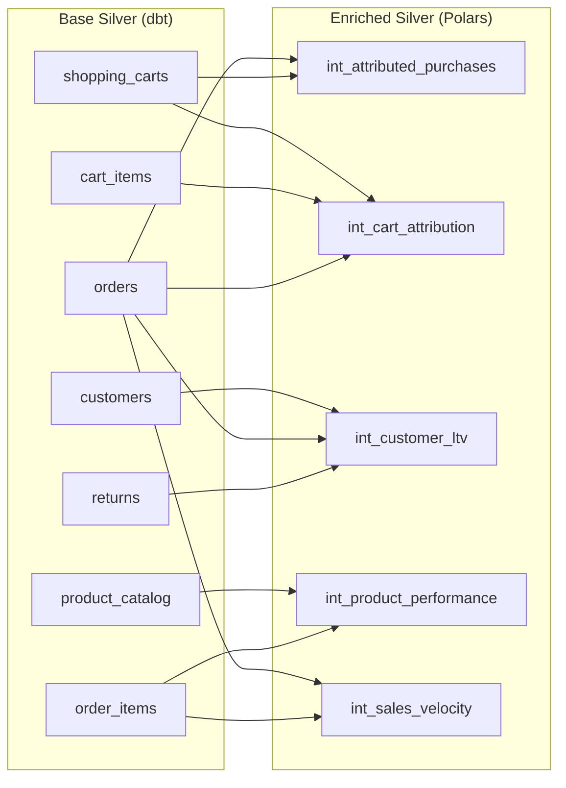

# Spec-Driven Orchestration Overview

## Purpose

This pipeline uses **layered YAML specs** to define what should exist per layer. The runtime spec drives table lists, partitions, quality gates, and paths, enabling:

- **Declarative pipeline configuration** - Define tables, partitions, and quality rules in YAML
- **Environment-agnostic orchestration** - Same spec works across local/dev/prod with env var overrides
- **Dynamic DAG generation** - Airflow DAGs auto-configure from spec metadata
- **Validation automation** - Quality gates automatically derive from spec definitions
- **Idempotency** - Spec-driven manifests enable safe reruns

## Architecture

### Spec Loading Flow

```mermaid
flowchart TD
    A[Config Directory<br/>config/specs/] --> B{Load Mode}
    B -->|Directory| C[Load 5 Required Files]
    B -->|Single File| D[Load Merged YAML]

    C --> E[bronze.yml]
    C --> F[silver_base.yml]
    C --> G[dims.yml]
    C --> H[enriched.yml]
    C --> I[validation.yml]

    E & F & G & H & I --> J[Deep Merge]
    D --> J

    J --> K[Expand Env Vars<br/>${VAR:-default}]
    K --> L[Pydantic Validation<br/>PipelineSpec]

    L -->|Valid| M[Runtime Spec Object]
    L -->|Invalid| N[SpecValidationError]

    M --> O[Pipeline Execution]
    O --> P[Runners<br/>dbt + Polars]
    O --> Q[Validation Gates<br/>3 layers]
    O --> R[Publish Logic<br/>staging + promote]

    style A fill:#f9f9f9
    style M fill:#ccffcc
    style N fill:#ffcccc
```

### Spec Hierarchy

**Priority Order** (highest to lowest):

1. **Runtime arguments** - CLI flags like `--ingest-dt`, `--enforce-quality`
2. **Environment variables** - `${BRONZE_BASE_PATH}`, `${SILVER_BASE_PATH}`, etc.
3. **Spec YAML files** - config/specs/*.yml with env var defaults
4. **Base config** - config/config.yml fallback values

**Example Resolution**:

```yaml
# config/specs/bronze.yml
bronze:
  base_path: "${BRONZE_BASE_PATH:-samples/bronze}"  # Default: samples/bronze
```

```bash
# Override with env var
export BRONZE_BASE_PATH="/mnt/production/bronze"

# Final value: /mnt/production/bronze
```

## Spec File Structure

### Directory Layout

```
config/specs/
├── bronze.yml          # Bronze layer metadata (8 tables)
├── silver_base.yml     # Base Silver dbt models (8 tables)
├── dims.yml            # Dimension snapshots (2 tables)
├── enriched.yml        # Enriched Polars transforms (10 tables)
└── validation.yml      # Validation settings
```

### bronze.yml

**Purpose**: Define Bronze layer tables, partition keys, and schema paths

**Schema**:

```yaml
bronze:
  base_path: "${BRONZE_BASE_PATH:-samples/bronze}"
  tables:
    - name: "customers"
      partition_key: "signup_date"       # EXCEPTION: Not ingest_dt
      schema_path: null                  # Optional: Avro/JSON schema path
    - name: "product_catalog"
      partition_key: "category"          # EXCEPTION: Not ingest_dt
    - name: "orders"
      partition_key: "ingest_dt"         # Standard partition key
    # ... 5 more tables
```

**Key Fields**:

- `name` (string, required) - Table name matching Bronze bucket prefix
- `partition_key` (string, required) - Hive partition column name
- `schema_path` (string, optional) - Path to schema definition file

**Usage**:

- Bronze quality validation reads table list from `bronze.tables`
- Partition keys used to construct file paths: `{base_path}/{table}/{partition_key}={value}/`
- Schema paths enable automated schema drift detection

**Partition Key Exceptions**:

| Table | Partition Key | Reason |
|-------|--------------|---------|
| `customers` | `signup_date` | Entity date (not ingestion date) |
| `product_catalog` | `category` | Reference data (not time-partitioned) |
| All others | `ingest_dt` | Standard arrival-time partitioning |

### silver_base.yml

**Purpose**: Define Base Silver dbt models, quality SLAs, and Bronze source mappings

**Schema**:

```yaml
silver_base:
  base_path: "${SILVER_BASE_PATH:-data/silver/base}"
  quarantine_path: "${SILVER_QUARANTINE_PATH:-data/silver/base/quarantine}"
  tables:
    - name: "orders"
      partition_key: "ingestion_dt"      # Silver uses ingestion_dt consistently
      source: "bronze.orders"            # Bronze source reference
      dbt_model: "stg_ecommerce__orders" # dbt model name
      quality:
        sla: 0.95                        # 95% quality threshold
        min_rows: 1                      # Minimum row count per partition
        allow_empty: false               # Reject empty partitions
    - name: "returns"
      partition_key: "ingestion_dt"
      source: "bronze.returns"
      dbt_model: "stg_ecommerce__returns"
      quality:
        sla: 0.95
        min_rows: 1
        allow_empty: true                # EXCEPTION: Returns can be empty
    # ... 6 more tables
```

**Key Fields**:

- `name` (string, required) - Silver table name
- `partition_key` (string, required) - Always `ingestion_dt` or `signup_dt` for customers
- `source` (string, required) - Bronze source table reference (`bronze.{table}`)
- `dbt_model` (string, required) - dbt model name in [models/staging/](../../dbt_duckdb/models/staging/)
- `quality.sla` (float, optional) - Quality threshold (0.0-1.0), from [config.yml:51-58](../../config/config.yml#L51-L58)
- `quality.min_rows` (int, optional) - Minimum rows per partition (default: 1)
- `quality.allow_empty` (bool, optional) - Allow zero-row partitions (default: false)

**Usage**:

- Base Silver runner reads table list to orchestrate dbt runs
- Silver quality validation uses `quality.sla` thresholds
- Quarantine path receives rejected rows failing PK/FK checks
- Source mappings drive Bronze → Silver row reconciliation

**Quality SLA Mapping**:

Spec SLAs override [config.yml:51-58](../../config/config.yml#L51-L58) defaults:

| Table | Spec SLA | Config SLA | Applied |
|-------|----------|------------|---------|
| `customers` | 0.98 | 0.98 | **0.98** (match) |
| `product_catalog` | 0.99 | 0.99 | **0.99** (match) |
| `orders` | 0.95 | 0.95 | **0.95** (match) |
| `returns` | 0.95 | 0.95 | **0.95** (match) |

### dims.yml

**Purpose**: Define dimension snapshot tables refreshed daily

**Schema**:

```yaml
dims:
  base_path: "${SILVER_DIMS_PATH:-data/silver/dims}"
  tables:
    - name: "customers"
      partition_key: "snapshot_dt"       # Daily snapshots
      dbt_model: "stg_ecommerce__customers"
    - name: "product_catalog"
      partition_key: "snapshot_dt"
      dbt_model: "stg_ecommerce__product_catalog"
```

**Key Fields**:

- `name` (string, required) - Dimension table name
- `partition_key` (string, required) - Always `snapshot_dt`
- `dbt_model` (string, required) - dbt model to snapshot

**Usage**:

- Dimension refresh DAG reads table list
- Freshness gate checks `_latest.json` pointer
- Snapshots avoid re-reading Bronze for every transform (60% reduction)

**Freshness Logic**:

```python
# From src/runners/dims_snapshot.py
def is_dims_fresh(run_date: str, dims_path: str) -> bool:
    latest_file = Path(dims_path) / "_latest.json"
    if not latest_file.exists():
        return False
    latest = json.loads(latest_file.read_text())
    return all(latest.get(table) == run_date for table in ["customers", "product_catalog"])
```

### enriched.yml

**Purpose**: Define Enriched Silver Polars transforms with input dependencies

**Schema**:

```yaml
silver_enriched:
  base_path: "${SILVER_ENRICHED_PATH:-data/silver/enriched}"
  lookback_days: ${ENRICHED_LOOKBACK_DAYS:-0}
  tables:
    - name: "int_attributed_purchases"
      partition_key: "order_dt"
      inputs:
        - "silver_base.shopping_carts"
        - "silver_base.orders"
      min_rows: 1
    - name: "int_cart_attribution"
      partition_key: "cart_dt"
      inputs:
        - "silver_base.shopping_carts"
        - "silver_base.cart_items"
        - "silver_base.orders"
      min_rows: 1
      semantic_checks:                   # Optional: table-specific checks
        - name: "converted_requires_order_id"
          expr: "cart_status = 'converted' and order_id is null"
      sanity_checks:                     # Optional: column sanity checks
        - "cart_value"
        - "abandoned_value"
    # ... 8 more transforms
```

**Key Fields**:

- `name` (string, required) - Transform output table name (prefixed with `int_`)
- `partition_key` (string, required) - Output partition column
- `inputs` (list[str], required) - Input table references (`silver_base.{table}`)
- `min_rows` (int, optional) - Minimum output rows (default: 1)
- `semantic_checks` (list, optional) - Business rule SQL expressions (violations flagged)
- `sanity_checks` (list, optional) - Column names for non-negative checks

**Usage**:

- Enriched runner reads table list to orchestrate Polars transforms
- Input dependencies drive data loading from [data/silver/base/](../../data/silver/base/)
- Partition keys determine output paths
- Lookback days control historical window for rolling metrics

**Input Dependency Graph**:



**Partition Key Mapping**:

| Transform | Partition Key | Business Meaning |
|-----------|--------------|------------------|
| `int_attributed_purchases` | `order_dt` | Order business date |
| `int_cart_attribution` | `cart_dt` | Cart creation business date |
| `int_inventory_risk` | `ingest_dt` | Snapshot arrival date |
| `int_customer_retention_signals` | `ingest_dt` | Snapshot arrival date |
| `int_customer_lifetime_value` | `ingest_dt` | Snapshot arrival date |
| `int_daily_business_metrics` | `date` | Calendar date |
| `int_product_performance` | `product_dt` | Product activity date |
| `int_sales_velocity` | `order_dt` | Order business date |
| `int_regional_financials` | `order_dt` | Order business date |
| `int_shipping_economics` | `order_dt` | Order business date |

### validation.yml

**Purpose**: Global validation settings

**Schema**:

```yaml
validation:
  reports_enabled: true
  output_dir: "${REPORTS_BASE_PATH:-docs/validation_reports}"
  strict_mode: false
```

**Key Fields**:

- `reports_enabled` (bool) - Generate markdown validation reports
- `output_dir` (string) - Report output directory
- `strict_mode` (bool) - Exit non-zero on quality failures

**Usage**:

- All validation modules read these settings
- Strict mode controls pipeline halt behavior
- Report directory receives Bronze/Silver/Enriched quality reports

**Strict Mode Behavior**:

| Mode | Bronze Fails | Silver Fails | Enriched Fails |
|------|-------------|--------------|----------------|
| `false` (default) | ⚠️ Log warning, continue | ⚠️ Log warning, continue | ⚠️ Log warning, continue |
| `true` | ❌ Exit 1, halt DAG | ❌ Exit 1, halt DAG | ❌ Exit 1, halt DAG |

## Environment Variable Support

### Expansion Syntax

**Pattern**: `${VAR_NAME:-default_value}`

**Examples**:

```yaml
base_path: "${BRONZE_BASE_PATH:-samples/bronze}"
# Expands to: samples/bronze (if BRONZE_BASE_PATH not set)
# Expands to: /mnt/production/bronze (if BRONZE_BASE_PATH=/mnt/production/bronze)

lookback_days: ${ENRICHED_LOOKBACK_DAYS:-0}
# Expands to: 0 (if ENRICHED_LOOKBACK_DAYS not set)
# Expands to: 7 (if ENRICHED_LOOKBACK_DAYS=7)
```

### Standard Environment Variables

| Variable | Default | Purpose |
|----------|---------|---------|
| `ECOM_SPEC_PATH` | `config/specs` | Spec directory path |
| `BRONZE_BASE_PATH` | `samples/bronze` | Bronze layer root |
| `SILVER_BASE_PATH` | `data/silver/base` | Base Silver root |
| `SILVER_DIMS_PATH` | `data/silver/dims` | Dimension snapshots root |
| `SILVER_ENRICHED_PATH` | `data/silver/enriched` | Enriched Silver root |
| `SILVER_QUARANTINE_PATH` | `data/silver/base/quarantine` | Quarantine root |
| `REPORTS_BASE_PATH` | `docs/validation_reports` | Validation reports |
| `ENRICHED_LOOKBACK_DAYS` | `0` | Historical window for rolling metrics |

### Per-Environment Configs

**Local Development**:

```bash
# .env.local
export BRONZE_BASE_PATH="samples/bronze"
export SILVER_BASE_PATH="data/silver/base"
export ENRICHED_LOOKBACK_DAYS=0
```

**Dev/Staging**:

```bash
# .env.dev
export BRONZE_BASE_PATH="gs://my-bucket-dev/bronze"
export SILVER_BASE_PATH="gs://my-bucket-dev/silver/base"
export ENRICHED_LOOKBACK_DAYS=7
```

**Production**:

```bash
# .env.prod
export BRONZE_BASE_PATH="gs://my-bucket-prod/bronze"
export SILVER_BASE_PATH="gs://my-bucket-prod/silver/base"
export ENRICHED_LOOKBACK_DAYS=30
```

## Spec Loading API

### Python API

**Load Spec**:

```python
from src.specs import load_spec

# Load from default path (config/specs/)
spec = load_spec()

# Load from custom path
spec = load_spec("config/specs_custom")

# Load from single merged file
spec = load_spec("config/my_spec.yml")

# Access spec sections
print(spec.bronze.base_path)  # samples/bronze
print(spec.silver_base.tables[0].name)  # customers
print(spec.validation.reports_enabled)  # True
```

**Safe Load** (returns None on error):

```python
from src.specs import load_spec_safe

spec = load_spec_safe()
if spec is None:
    # Fallback to config.yml defaults
    print("Spec load failed, using config defaults")
```

**Environment Override**:

```python
import os
from src.specs import load_spec

# Override env var before loading
os.environ["BRONZE_BASE_PATH"] = "/tmp/bronze"
spec = load_spec()
print(spec.bronze.base_path)  # /tmp/bronze
```

### CLI Usage

**Validation Modules**:

```bash
# Bronze quality validation with spec
ecomlake bronze validate \
  --spec-path config/specs \
  --partition-date 2025-10-15

# Silver validation with spec
ecomlake silver validate \
  --spec-path config/specs \
  --partition-date 2025-10-15

# Enriched validation with spec
ecomlake enriched validate \
  --spec-path config/specs \
  --ingest-dt 2025-10-15
```

**Runner Modules**:

```bash
# Dimension snapshot with spec
ecomlake dim run \
  --spec-path config/specs \
  --run-date 2025-10-15

# Enriched transforms with spec
ecomlake enriched run \
  --spec-path config/specs \
  --ingest-dt 2025-10-15
```

## Spec-Driven Orchestration

### DAG Configuration

**ecom_dim_refresh_pipeline** ([airflow/dags/ecom_dim_refresh.py](../../airflow/dags/ecom_dim_refresh.py)):

```python
from src.specs import load_spec

spec = load_spec()

# Dynamic task creation from spec
for table_spec in spec.dims.tables:
    snapshot_task = PythonOperator(
        task_id=f"snapshot_{table_spec.name}",
        python_callable=run_snapshot,
        op_kwargs={
            "table_name": table_spec.name,
            "dbt_model": table_spec.dbt_model,
            "partition_key": table_spec.partition_key,
        },
    )
```

**ecom_silver_to_gold_pipeline** ([airflow/dags/ecom_silver_to_gold.py](../../airflow/dags/ecom_silver_to_gold.py)):

```python
from src.specs import load_spec

spec = load_spec()

# Base Silver tasks (dbt)
for table_spec in spec.silver_base.tables:
    dbt_task = BashOperator(
        task_id=f"dbt_run_{table_spec.name}",
        bash_command=f"dbt run --select {table_spec.dbt_model}",
    )

# Enriched Silver tasks (Polars)
for table_spec in spec.silver_enriched.tables:
    polars_task = PythonOperator(
        task_id=f"enriched_{table_spec.name}",
        python_callable=run_transform,
        op_kwargs={
            "table_name": table_spec.name,
            "inputs": table_spec.inputs,
            "partition_key": table_spec.partition_key,
        },
    )
```

### Validation Integration

**Three-Layer Validation** uses spec metadata for automated checks:

**Bronze Validation**:

```python
from src.specs import load_spec
from src.validation.bronze_quality import validate_bronze_layer

spec = load_spec()
results = validate_bronze_layer(
    bronze_path=spec.bronze.base_path,
    tables=[t.name for t in spec.bronze.tables],
    partition_date="2025-10-15",
)
```

**Silver Validation**:

```python
from src.specs import load_spec
from src.validation.silver import validate_silver_layer

spec = load_spec()
results = validate_silver_layer(
    bronze_path=spec.bronze.base_path,
    silver_path=spec.silver_base.base_path,
    tables=[t.name for t in spec.silver_base.tables],
    partition_date="2025-10-15",
)
```

**Enriched Validation**:

```python
from src.specs import load_spec
from src.validation.enriched import validate_enriched_layer

spec = load_spec()
results = validate_enriched_layer(
    enriched_path=spec.silver_enriched.base_path,
    tables=[t.name for t in spec.silver_enriched.tables],
    ingest_dt="2025-10-15",
)
```

## Spec Extension Patterns

### Adding a New Transform

**1. Update enriched.yml**:

```yaml
silver_enriched:
  tables:
    # ... existing transforms
    - name: "int_customer_segmentation"
      partition_key: "ingest_dt"
      inputs:
        - "silver_base.customers"
        - "silver_base.orders"
      min_rows: 1
      semantic_checks:
        - name: "segment_not_null"
          expr: "segment is null"
      sanity_checks:
        - "lifetime_value"
        - "order_frequency"
```

**2. Implement Transform** ([src/transforms/customer_segmentation.py](../../src/transforms/)):

```python
import polars as pl

def compute_customer_segmentation(
    df_customers: pl.LazyFrame,
    df_orders: pl.LazyFrame,
) -> pl.LazyFrame:
    # Transform logic
    return result
```

**3. Create Runner** ([src/runners/enriched/customer_segmentation.py](../../src/runners/enriched/)):

```python
from src.runners.enriched.shared import run_enriched_transform
from src.transforms.customer_segmentation import compute_customer_segmentation

def run_customer_segmentation(ingest_dt: str, base_path: str, output_path: str):
    run_enriched_transform(
        transform_fn=compute_customer_segmentation,
        ingest_dt=ingest_dt,
        base_path=base_path,
        output_path=output_path,
        table_name="int_customer_segmentation",
    )
```

**4. DAG Auto-Discovers** - No DAG changes needed! Spec loader auto-registers new transform.

### Adding Quality Checks

**Spec-Based Checks** (declarative):

```yaml
# config/specs/enriched.yml
tables:
  - name: "int_product_performance"
    semantic_checks:
      - name: "units_returned_within_tolerance"
        expr: "units_sold > 0 and units_returned > (units_sold * 2.0)"
      - name: "return_rate_le_one"
        expr: "return_rate is not null and return_rate > 1.0"
    sanity_checks:
      - "units_sold"
      - "gross_revenue"
```

**Code-Based Checks** (config.yml):

```yaml
# config/config.yml
validation:
  sanity_checks:
    non_negative:
      - "units_sold"
      - "gross_revenue"
    rate_0_1:
      - "return_rate"
      - "cart_conversion_rate"
  semantic_checks:
    int_product_performance:
      - name: "units_returned_within_tolerance"
        expr: "units_sold > 0 and units_returned > (units_sold * {return_units_max_ratio})"
```

**Recommendation**: Use **spec-based checks** for table-specific rules, **config-based checks** for global rules.

## Spec Validation

### Schema Validation

Specs are validated with Pydantic models ([src/specs/models.py](../../src/specs/models.py)):

**BronzeTableSpec**:

```python
class BronzeTableSpec(BaseModel):
    name: str = Field(..., min_length=1)
    partition_key: str = Field(..., min_length=1)
    schema_path: str | None = None
```

**SilverBaseTableSpec**:

```python
class SilverBaseTableSpec(BaseModel):
    name: str = Field(..., min_length=1)
    partition_key: str = Field(..., min_length=1)
    source: str = Field(..., min_length=1)
    dbt_model: str = Field(..., min_length=1)
    quality: QualitySpec | None = None
```

**Error Handling**:

```python
from src.specs import load_spec, SpecValidationError

try:
    spec = load_spec()
except SpecValidationError as e:
    print(f"Spec validation failed: {e}")
    # Fallback to config.yml defaults
```

### Required Files Check

When loading from a directory, all 5 files are required:

```python
# src/specs/loader.py:85-96
required = [
    "bronze.yml",
    "silver_base.yml",
    "enriched.yml",
    "dims.yml",
    "validation.yml",
]
for name in required:
    spec_file = path / name
    if not spec_file.exists():
        raise SpecValidationError(f"Missing required spec file: {spec_file}")
```

**Bypass Check**: Use a single merged YAML file instead of directory.

## Best Practices

### 1. Use Env Vars for Path Overrides

**Good**:

```yaml
bronze:
  base_path: "${BRONZE_BASE_PATH:-samples/bronze}"
```

**Bad**:

```yaml
bronze:
  base_path: "samples/bronze"  # Hardcoded, not environment-agnostic
```

### 2. Keep Specs DRY (Don't Repeat Yourself)

Use [config.yml](../../config/config.yml) for global defaults, specs for table-specific overrides:

**config.yml** (global):

```yaml
sla_thresholds:
  orders: 0.95
  customers: 0.98
```

**silver_base.yml** (override):

```yaml
tables:
  - name: "customers"
    quality:
      sla: 0.98  # Matches config default
```

### 3. Document Spec Changes in Commits

When adding/removing tables or changing quality thresholds, update:

- Spec YAML files
- [SPEC_OVERVIEW.md](SPEC_OVERVIEW.md) (this document)
- [DATA_CONTRACT.md](DATA_CONTRACT.md) (if schema changes)
- [TRANSFORMATION_SUMMARY.md](TRANSFORMATION_SUMMARY.md) (if transform logic changes)

### 4. Test Spec Changes Locally First

```bash
# Load spec and validate
python -c "from src.specs import load_spec; spec = load_spec(); print('Spec valid!')"

# Run validation with spec
ecomlake local silver --date 2025-10-15
ecomlake local enriched --date 2025-10-15
```

### 5. Use Strict Mode in Production

**Local/Dev**:

```yaml
validation:
  strict_mode: false  # Warnings only
```

**Production**:

```yaml
validation:
  strict_mode: true  # Halt on failures
```

Or override with env var:

```bash
export VALIDATION_STRICT_MODE=true
```

## Troubleshooting

### Spec Load Failures

**Symptom**: `SpecValidationError: Missing required spec file: config/specs/bronze.yml`

**Fix**: Ensure all 5 spec files exist in `config/specs/`:

```bash
ls -la config/specs/
# Should show: bronze.yml, silver_base.yml, dims.yml, enriched.yml, validation.yml
```

**Symptom**: `SpecValidationError: Spec validation failed: ...`

**Fix**: Check Pydantic validation error details for missing/invalid fields.

### Env Var Expansion Issues

**Symptom**: Spec expands to empty string: `base_path: ""`

**Debug**:

```python
from src.specs import load_spec

spec = load_spec()
print(spec.bronze.base_path)  # Empty string

# Check env var
import os
print(os.getenv("BRONZE_BASE_PATH"))  # None
```

**Fix**: Set env var or rely on default:

```bash
export BRONZE_BASE_PATH="samples/bronze"
```

### Table Not Found Errors

**Symptom**: `ValueError: Table 'int_new_transform' not found in spec`

**Fix**: Add table to [config/specs/enriched.yml](../../config/specs/enriched.yml):

```yaml
silver_enriched:
  tables:
    - name: "int_new_transform"
      partition_key: "ingest_dt"
      inputs: ["silver_base.orders"]
      min_rows: 1
```

### Quality SLA Mismatches

**Symptom**: Silver validation fails with unexpected SLA threshold

**Debug**: Check spec vs config defaults:

```python
from src.specs import load_spec

spec = load_spec()
for table in spec.silver_base.tables:
    if table.name == "orders":
        print(table.quality.sla)  # 0.95
```

**Fix**: Update spec SLA to match expected threshold:

```yaml
# config/specs/silver_base.yml
tables:
  - name: "orders"
    quality:
      sla: 0.98  # Updated from 0.95
```

## Related Documentation

- **[CONFIG_STRATEGY.md](CONFIG_STRATEGY.md)** - Global config.yml settings and environment strategy
- **[ARCHITECTURE.md](ARCHITECTURE.md)** - Complete pipeline architecture with spec-driven flow
- **[CLI_USAGE_GUIDE.md](CLI_USAGE_GUIDE.md)** - CLI commands and spec-path arguments
- **[VALIDATION_GUIDE.md](VALIDATION_GUIDE.md)** - Three-layer validation framework using specs
- **[TRANSFORMATION_SUMMARY.md](TRANSFORMATION_SUMMARY.md)** - Enriched transform details

---

**Last Updated**: 2026-01-23
**Spec Version**: 1.0.0
**Required Spec Files**: 5 (bronze, silver_base, dims, enriched, validation)

---

<p align="center">
  <a href="../../README.md">🏠 <b>Home</b></a>
  &nbsp;·&nbsp;
  <a href="../../RESOURCE_HUB.md">📚 <b>Resource Hub</b></a>
</p>

<p align="center">
  <sub>Last updated: 2026-01-24</sub><br>
  <sub>✨ Transform the data. Tell the story. Build the future. ✨</sub>
</p>
