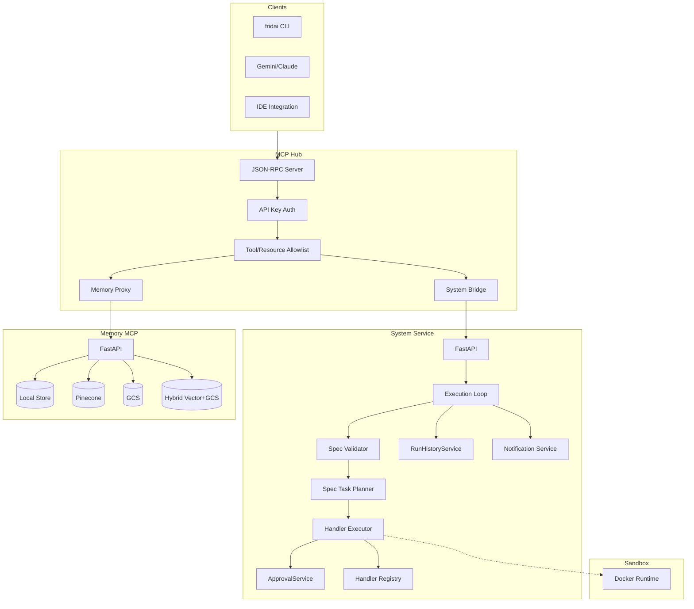
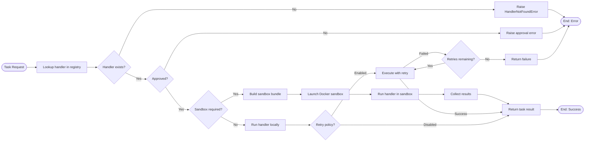
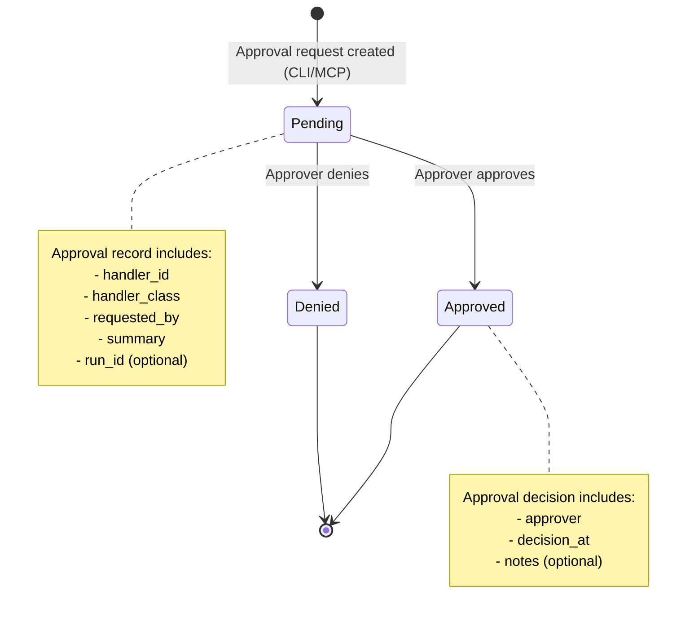
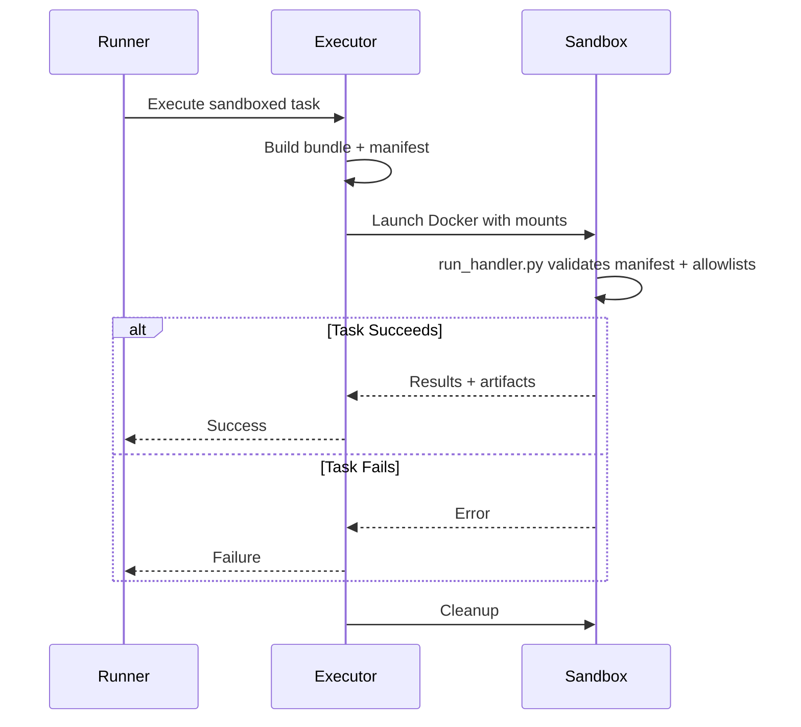
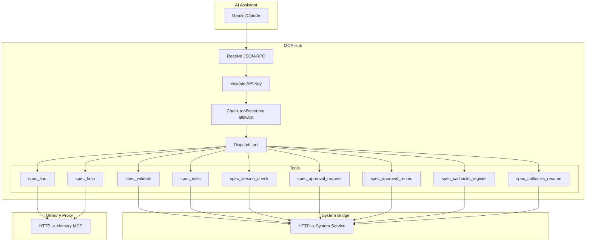
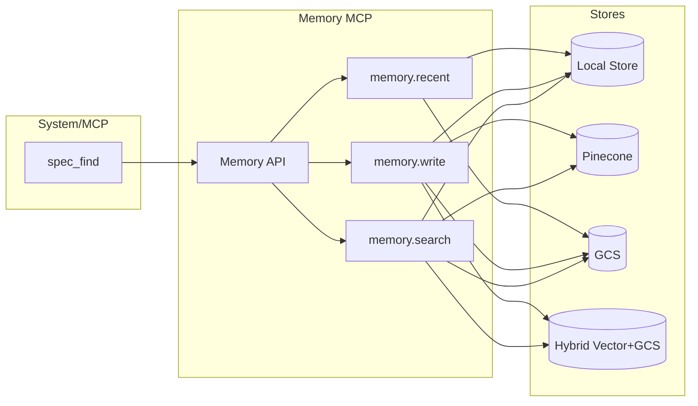
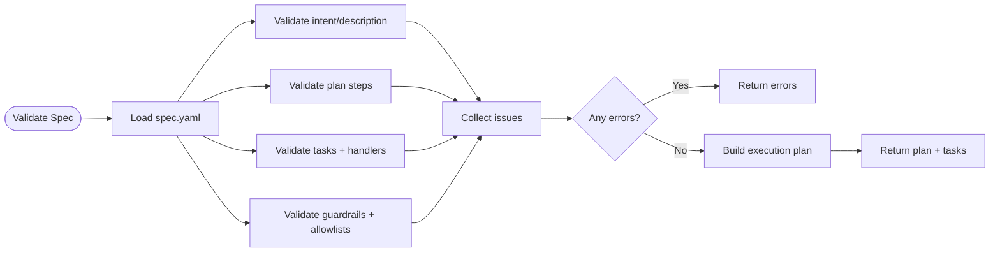
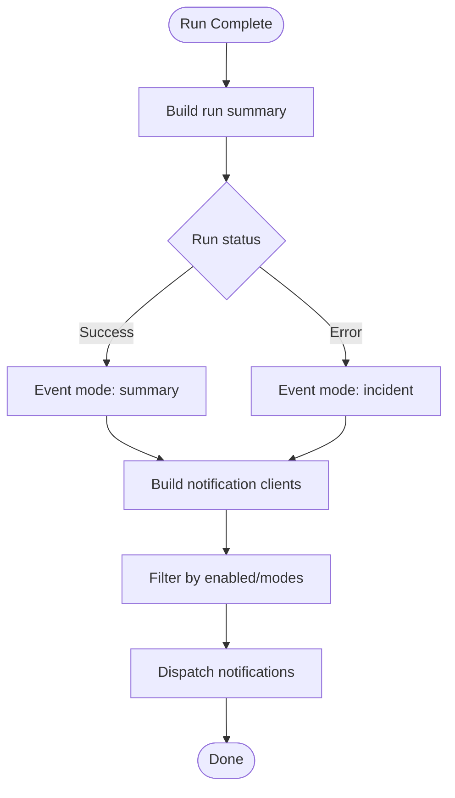

# Fridai System - Execution Flows

> Visual guide to system execution, governance, and integration flows

**Last Updated:** 2025-12-12

---

## Overview

This document captures the current execution flow for the Fridai System after the refactor to preset-driven runtime config and unified specs.

**Key Components:**
- **MCP Hub**: JSON-RPC gateway for AI assistants
- **System Service**: HTTP API for validation/execution resources
- **Execution Loop**: Validation, planning, approvals, handler execution
- **Handler Registry**: Pluggable executors with approval classes + sandbox flags
- **Memory MCP**: Spec discovery and memory cards (optional)
- **Notifications**: CLI, Slack, Email, Jira
- **Sandbox**: Docker-based isolated execution

---

## 1. High-Level Architecture



---

## 2. Spec Execution Flow

```mermaid
flowchart TD
    Start([Execute Spec]) --> LoadSpec[Load spec.yaml]
    LoadSpec --> Validate{Validate Guardrails}

    Validate -->|Error| ReturnErrors[Return validation issues]
    ReturnErrors --> End([End: Failure])

    Validate -->|Success| Plan[Build task plan]
    Plan --> ApprovalCheck{Approval Required?}

    ApprovalCheck -->|Not Approved| Blocked[Fail with approval error]
    Blocked --> End

    ApprovalCheck -->|Approved| Execute[Execute tasks]
    Execute --> Result{All tasks ok?}

    Result -->|Error| RecordFail[Append run history (error)]
    Result -->|Success| RecordOk[Append run history (success)]

    RecordFail --> Notify[Send notifications]
    RecordOk --> Notify

    Notify --> EndSuccess([End])
```

Notes:
- Specs are unified `spec.yaml` files under `packages/system/specs/active`.
- Approvals are checked at execution time and fail fast (no pause loop).

---

## 3. Handler Invocation Flow



---

## 4. Approval Workflow



Notes:
- Approvals are created explicitly (CLI/MCP), then checked by `ApprovalService` during execution.
- There is no automatic pause/resume loop in the executor.

---

## 5. Sandbox Execution Flow



Sandbox notes:
- Docker-only provider today.
- Default: non-root, caps dropped, read-only rootfs, tmpfs `/tmp`, seccomp default.
- Network default `none`; network requires approval-gated tasks with explicit approval.
- Allowlists enforced by manifest + runtime checks; writes confined to `/app/artifacts/`.

---

## 6. MCP Integration Flow



---

## 7. Memory Integration Flow



Notes:
- Memory store is selected via `FRIDAI_MEMORY_STORE` (local, gcs, pinecone, hybrid/vector_gcs).
- Spec discovery flows through `spec_find` -> `memory.search`.

---

## 8. Run History Rotation Flow

```mermaid
flowchart TD
    Start([Run Completed]) --> Append[Append entry to run_history.json]
    Append --> Stored[tmp/logs/system/run_history.json]

    Stored --> Rotate[fridai history]
    Rotate --> Split{Over max_entries?}

    Split -->|No| Done([Done])
    Split -->|Yes| Archive[Write archive file]
    Archive --> ArchivePath[tmp/logs/system/archive/run_history_*.json]
    ArchivePath --> Upload{Upload enabled?}

    Upload -->|No| Done
    Upload -->|Yes| Stub[Upload stub (future)]
    Stub --> Done
```

---

## 9. Configuration Resolution Flow

```mermaid
flowchart TB
    Start([Startup]) --> LoadPreset[Load preset config/presets/<name>.yaml]

    LoadPreset --> BuildRuntime[Build RuntimeConfig]
    BuildRuntime --> Approvals[execution.approvals]
    BuildRuntime --> Notifications[execution.notifications]
    BuildRuntime --> RunHistory[execution.run_history]
    BuildRuntime --> Sandbox[execution.sandbox]

    BuildRuntime --> ResolveSecrets[Resolve secrets]
    ResolveSecrets --> SecretsYAML[config/secrets.yaml]
    ResolveSecrets --> Env[Environment variables]
    ResolveSecrets --> GSM[Google Secret Manager (optional)]

    GSM --> BuildRegistry[Build handler registry]
    Env --> BuildRegistry
    SecretsYAML --> BuildRegistry

    BuildRegistry --> Ready([Ready])
```

Notes:
- Presets are canonical. Legacy profiles exist only for backward compatibility.

---

## 10. Validation & Planning Flow



---

## 11. Notification Dispatch Flow



---

## See Also

- [SYSTEM_RUNBOOK.md](./SYSTEM_RUNBOOK.md) - System operations guide
- [HUB_MCP_RUNBOOK.md](./HUB_MCP_RUNBOOK.md) - MCP hub operations
- [MEMORY_RUNBOOK.md](./MEMORY_RUNBOOK.md) - Memory service operations
- [System Package Documentation](../packages/system/) - Architecture and API reference
- [System Flow Documentation](../packages/system/flow.md) - Additional flow diagrams
