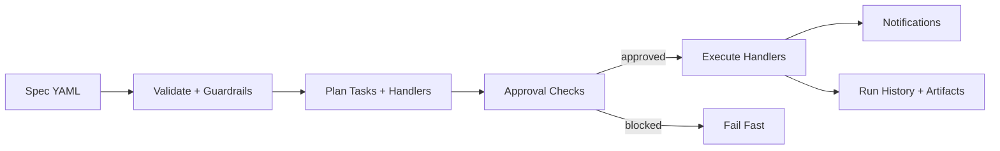
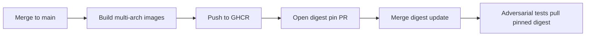
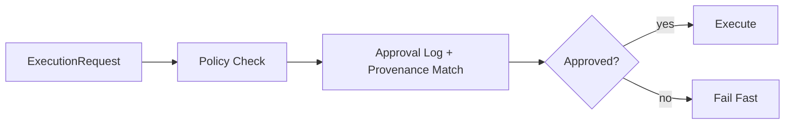

# FridAI System — Operations Runbook

> Spec-driven automation with governance, approvals, and auditable execution.

**Last Updated:** 2025-12-24 (Phase 0–5 complete)

---

## 1) Executive Summary

The **FridAI System** validates and executes spec-driven automation with governance guardrails. It is designed to be safe-by-default, traceable end-to-end, and operable by on‑call teams without guesswork.

**What you get:**
- **Spec-driven execution**: Validate and execute unified YAML specs
- **Handler registry**: Pluggable handlers with approval classes, sandbox requirements, retry policies
- **Governance guardrails**: Validation gates, approvals, run history auditing, allowlists
- **Multi‑channel notifications**: CLI, Slack, Email, Jira alerts with event filtering
- **System service**: HTTP API for validate/execute and operational resources
- **Run history**: Local audit trail with rotation/archiving support

<div class="doc-tile">

**Outcome lens (what “healthy” looks like)**
- Specs validate cleanly (no blocking warnings)
- Approval policies match intended risk posture
- Sandboxed execution works for risky handlers
- Notifications fire for incidents and summaries
- Run history + approvals are complete and traceable

</div>

---

## 2) System At A Glance

| Surface | Primary Purpose | Source of Truth |
| --- | --- | --- |
| Presets | Runtime governance + execution config | `config/presets/*.yaml` |
| Approvals | Approval policy + provenance checks | `execution.approvals` in presets + approvals log |
| Run history | Audit trail + rotation/archiving | `tmp/logs/system/run_history.json` |
| System service | Validate/execute + resources | `http://localhost:8000` |
| Sandbox images | Isolation for risky handlers | GHCR + `config/sandbox_images.yaml` |

---

## 3) Execution Lifecycle (End‑to‑End)

<div class="doc-tile">

**Execution Flow**

- **Validation**: Guardrails check intent/plan/tasks against runtime policies
- **Planning**: Tasks mapped to handlers + approvals
- **Approval checks**: Approval policies + approval log entries enforced
- **Execution**: Runner invokes handlers (direct or sandboxed)
- **Notifications**: Multi‑channel alerts on success/failure
- **Run history**: Append run entry and artifacts to log

</div>



---

## 4) Local Docker + CI Sandbox Images

<div class="doc-tile">

**Local Docker (core + system + memory)**

```bash
make docker-build
make docker-up
```

- System service: `http://localhost:8000`

**CI Sandbox Image Publish (GHCR)**

- **Trigger**: merges to `main` that affect sandbox build context
- **Registry**: `ghcr.io/G-Schumacher44/fridai-sandbox`
- **Digest pins**: `config/sandbox_images.yaml`

**High‑level flow**

- CI builds multi‑arch sandbox images (amd64/arm64)
- CI pushes to GHCR
- CI opens a PR with updated digest pins
- Adversarial tests pull the pinned digest on schedule

</div>



### Publish + Digest Verification Checklist

<div class="doc-tile">

1. Merge changes to `main` that affect sandbox build context.
2. Confirm `sandbox-build-deploy` publishes images to GHCR.
3. Merge the digest update PR (`config/sandbox_images.yaml`).
4. Verify `scripts/check_sandbox_images.py` passes in CI.
5. Confirm scheduled adversarial tests pull the pinned digest.

</div>

### Adversarial CI Policy

- PRs run **non‑stress** adversarial tests (no CPU/mem/pids stress).
- Scheduled jobs run the **full stress** suite.

---

## 5) Authentication & Security Notes

<div class="doc-tile">

**Non‑negotiables**
- **API auth**: System service requires `FRIDAI_MCP_API_KEY` (`X-API-Key` or `Authorization: Bearer ...`).
- **/health auth**: `/health` is protected and returns:
  - `503` when no server key is configured
  - `401` for invalid/missing keys
- **Profile governance**: The system service ignores per‑request `profile` (host profile wins).
- **Handlers invoke**: `/handlers/invoke` is not API‑key protected in current code; protect via network controls or add auth in production.

</div>

---

## 6) Approval Decision Flow (Phase 0 Provenance)

Approval decisions are routed through `ApprovalService.evaluate()` for both validation and execution.



### Decision Flow

1. **Policy check** (`execution.approvals` in preset):
   - `default_required`: global approval gate
   - `auto_approve`: handler classes that are auto‑approved
   - `blocked_handlers`: handler IDs that are always blocked
   - `require_approval_above_cost`: optional cost guardrail

2. **Approval log check with provenance matching** (`ApprovalLog`, Phase 0):
   - Searches for `APPROVED` records matching `handler_id` and `run_id`
   - **Provenance validation** — ALL hashes must match if provided:
     - `spec_hash`: Approval bound to exact spec version
     - `artifact_hash`: Approval bound to exact input artifacts
     - `handler_params_hash`: Approval bound to exact handler parameters
     - `workspace_root`: Approval bound to exact workspace path
   - If ANY hash mismatches, approval is denied

3. **Request override** (`ExecutionRequest.approved_handlers`):
   - Explicit approvals supplied by CLI/MCP callers

4. **Decision**:
   - If not approved, execution fails fast (no pending pause)
   - If approved but provenance mismatches, execution denied

### Provenance Example

```bash
# Create provenance-bound approval
fridai approvals request \
  --handler apply_patch \
  --summary "Apply security patch v2.1" \
  --run-id run-789 \
  --spec-hash sha256:abc123... \
  --workspace-root /workspace/myproject

# Approve
fridai approvals decide --id appr_2025_... --decision approve

# Execution validates ALL provenance fields match
```

### Workspace Allowlisting (Phase 0)

Enforce workspace boundaries:

```bash
export FRIDAI_ALLOWED_WORKSPACE_ROOTS="/workspace/project-a,/workspace/project-b"
```

See [runtime_paths.py:44-57](../../packages/system/src/fridai_system/runtime_paths.py#L44-L57).

### Used By

- `Executor.guard(...)` and `Executor.execute(...)` for all approval decisions
- Network governance: tasks requiring network access must be approval‑gated
- Patch handler (Phase 4): Mandatory provenance for `apply_patch`

---

## 7) Prerequisites

### Required

- **Python 3.11+** with FridAI packages installed
  ```bash
  conda activate fridai-core
  # OR
  source venv/bin/activate

  python --version
  pip list | grep fridai
  ```

- **Preset configuration** in `config/presets/*.yaml` (canonical runtime source)

### Optional (production)

- **Google Secret Manager** for secret resolution
  ```bash
  gcloud auth application-default login
  ```

- **Notification channels**: Slack webhook, SMTP credentials, Jira API token
  - See `docs/runbooks/COMMON_RUNBOOK.md`

---

## 8) Configuration

### Runtime Configuration (Presets)

Create or edit a preset in `config/presets/<name>.yaml` and select it via
`FRIDAI_PROFILE` or `fridai exec --profile <name>`.

```yaml
preset:
  id: ops
  extends: base

  execution:
    approvals:
      default_required: true
      auto_approve: ["read_only"]
      blocked_handlers: ["git_push"]
      require_approval_above_cost: 50.0

    notifications:
      cli:
        enabled: true
        modes: ["summary", "incident"]
      slack:
        webhook_env: FRIDAI_SLACK_WEBHOOK_URL
        modes: ["incident"]

    run_history:
      local_path: tmp/logs/system/run_history.json
      max_entries: 200
      archive_bucket: gs://fridai-run-history
      archive_prefix: runs

    executor:
      enabled: true
      dry_run: false

    sandbox:
      enabled: true
      provider: docker
      timeout_seconds: 600

    automation:
      allowed_repos: ["github.com/your-org"]
      allowed_gcs_buckets: ["fridai-artefacts"]
      allowed_bigquery_datasets: []
      allowed_http_hosts: ["example.com"]
```

### Secret Configuration

Edit `config/secrets.yaml`:

```yaml
secrets:
  slack_webhook:
    env: FRIDAI_SLACK_WEBHOOK_URL
    gsm: projects/${env:GOOGLE_CLOUD_PROJECT}/secrets/slack-webhook/versions/latest

  smtp_password:
    env: FRIDAI_EMAIL_PASSWORD
    gsm: projects/${env:GOOGLE_CLOUD_PROJECT}/secrets/smtp-password/versions/latest
```

### Legacy Runtime Overrides (optional)

`fridai validate` and `fridai exec` can accept a JSON runtime override for CI/diagnostics:

```bash
fridai validate --config config/generated/runtime.json
fridai exec --spec spec.system_primary --config config/generated/runtime.json
```

The legacy `config/human/runtime.yaml` and translation steps are no longer part of the normal runtime path.

---

## 9) CLI Operations

### Spec Validation

`fridai validate` validates **all specs** under `packages/system/specs/active`.

```bash
fridai validate --output text
fridai validate --output json
fridai validate --fail-on-warning
```

To validate a single spec by ID, use a dry‑run execution or the system service endpoint:

```bash
fridai exec --spec spec.system_primary --dry-run --output json
```

### Spec Execution

```bash
# Execute a spec by ID
fridai exec --spec spec.system_primary --notify cli --output text

# Execute with multiple channels (repeat --notify)
fridai exec --spec spec.system_primary --notify cli --notify slack

# Dry run (CLI notifications only)
fridai exec --spec spec.system_primary --dry-run

# Use a specific preset
fridai exec --spec spec.system_primary --profile production
```

### Approval Management

```bash
# List approvals
fridai approvals list --status pending
fridai approvals list

# Request approval
fridai approvals request \
  --handler-id git_push \
  --handler-class sensitive \
  --summary "Push release branch" \
  --requested-by ops-lead \
  --run-id run-20251212-123456

# Record decision
fridai approvals decide abc123 --decision approve --approver ops-lead
fridai approvals decide abc123 --decision deny --approver ops-lead --notes "Insufficient justification"

# Rotate approvals log
fridai approvals rotate --dry-run
fridai approvals rotate --skip-upload
```

### Run History Rotation

```bash
# Preview rotation
fridai history --dry-run

# Rotate and archive (if archive_bucket configured)
fridai history --apply --upload
```

### Manual Notifications

```bash
# Send a test notification (summary file required)
cat <<'JSON' > tmp/notify_summary.json
{
  "run_id": "manual-test",
  "status": "success",
  "tasks": [],
  "issues": []
}
JSON

fridai notify --channel slack --summary-file tmp/notify_summary.json --profile default
```

### Secrets Inspection

```bash
fridai config secrets
fridai config secrets slack_webhook
```

---

## 10) System Service API

The system service exposes validation/execution and operational resources.

### Health

```bash
curl -H "X-API-Key: $FRIDAI_MCP_API_KEY" http://127.0.0.1:8000/health
```

### Validate

```bash
curl -X POST "http://127.0.0.1:8000/validate?spec_id=spec.system_primary" \
  -H "X-API-Key: $FRIDAI_MCP_API_KEY"
```

### Execute

```bash
curl -X POST http://127.0.0.1:8000/execute \
  -H "X-API-Key: $FRIDAI_MCP_API_KEY" \
  -H "Content-Type: application/json" \
  -d '{
    "spec_id": "spec.system_primary",
    "notify": true,
    "allowed_channels": ["cli", "slack"],
    "dry_run": false
  }'
```

### Resources

```bash
# Recent run history
curl -H "X-API-Key: $FRIDAI_MCP_API_KEY" \
  "http://127.0.0.1:8000/resources/runs.history?limit=10"

# Approval policy
curl -H "X-API-Key: $FRIDAI_MCP_API_KEY" \
  http://127.0.0.1:8000/resources/approvals.policy

# Recent approvals
curl -H "X-API-Key: $FRIDAI_MCP_API_KEY" \
  "http://127.0.0.1:8000/resources/approvals.recent?limit=10"

# System snapshot (handlers + approvals + latest run)
curl -H "X-API-Key: $FRIDAI_MCP_API_KEY" \
  http://127.0.0.1:8000/resources/system.world
```

**Bridge Note:** The MCP hub uses `FRIDAI_SYSTEM_URL` to reach this service. The `profile` parameter on system endpoints is ignored for governance reasons.

---

## 11) Run History & Approvals

### Run History

Default path: `tmp/logs/system/run_history.json` (JSON list of run entries).

```bash
jq '.[-1]' tmp/logs/system/run_history.json
```

### Approvals Log

Default path: `tmp/logs/system/approvals.json`.

```bash
jq '.[-1]' tmp/logs/system/approvals.json
```

---

## 12) Sandbox Operations

- Sandbox configuration is driven by `execution.sandbox` in presets.
- Handler‑level sandbox requirements live in spec tasks (`sandbox.required`).
- Network access is only allowed for approval‑gated tasks with explicit approval.

See `docs/guides/SANDBOX_GUIDE.md` for implementation details.

### Local LLM + Agent Smoke (Opt‑In)

Use this when validating the agent runtime or local LLM wiring (Ollama/OpenAI‑compatible).

**Prereqs**
- Docker installed and running
- Ollama running (`ollama serve`) with models pulled
- Sandbox image built locally

**Build sandbox image**
```bash
python scripts/build_sandbox_image.py
# or
make sandbox-image
```

**Local vs registry images**
- Local development should use tags (e.g., `fridai-sandbox:local`).
- Digest refs (`repo@sha256:...`) only work if the image is pulled from a registry.

**Run local LLM tests (skips unless enabled)**
```bash
FRIDAI_RUN_LOCAL_LLM_TESTS=1 \
FRIDAI_SANDBOX_IMAGE=fridai-sandbox:local \
FRIDAI_LLM_PROVIDER=openai \
OPENAI_API_KEY=ollama \
OPENAI_BASE_URL=http://localhost:11434/v1 \
FRIDAI_LLM_MODEL=deepseek-r1:7b \
pytest packages/system/tests/sandbox/test_agent_runtime_local.py -v
```

**Note:** Some DeepSeek distill models (e.g., `deepseek-r1:7b-qwen-distill-q4_K_M`) do not support tool calls in Ollama. Use a tool‑capable model like `qwen2.5-coder:7b` if the agent tests skip.

**Optional performance checks**
```bash
FRIDAI_RUN_LOCAL_LLM_TESTS=1 \
FRIDAI_SANDBOX_IMAGE=fridai-sandbox:local \
pytest packages/system/tests/sandbox/test_local_model_performance.py -v -m benchmark
```

### Docker E2E Sandbox Test (Opt‑In)

This validates actual handler execution inside the sandbox container.

```bash
FRIDAI_RUN_DOCKER_E2E=1 \
FRIDAI_SANDBOX_IMAGE=fridai-sandbox:local \
pytest packages/system/tests/sandbox/test_sandbox_end_to_end.py::test_noop_handler_executes_in_docker -v
```

---

## 13) Troubleshooting

### Validation Fails

**Problem:** Spec validation fails

**Fixes:**
1. Review validation output:
   ```bash
   fridai validate --output json | jq .
   ```
2. Confirm specs exist under `packages/system/specs/active/`.
3. Check preset config:
   ```bash
   rg -n "execution" config/presets/default.yaml
   ```

### Approval Blocked

**Problem:** Execution fails with approval error

**Fixes:**
1. List approvals:
   ```bash
   fridai approvals list --status pending
   ```
2. Approve the handler:
   ```bash
   fridai approvals decide <record_id> --decision approve --approver ops-lead
   ```
3. Verify policy (auto_approve/blocked_handlers):
   ```bash
   rg -n "approvals" config/presets/default.yaml
   ```

### Notifications Not Sent

**Fixes:**
1. Check notification config in the active preset.
2. Verify secrets:
   ```bash
   fridai config secrets
   ```
3. Send a test notification:
   ```bash
   cat <<'JSON' > tmp/notify_summary.json
   {
     "run_id": "manual-test",
     "status": "success",
     "tasks": [],
     "issues": []
   }
   JSON

   fridai notify --channel slack --summary-file tmp/notify_summary.json
   ```

### System Service 401/503

- `503`: server missing `FRIDAI_MCP_API_KEY`
- `401`: invalid/missing key in request

---

## 14) Reference Commands

```bash
# Validate all specs
fridai validate --output text

# Execute a spec
fridai exec --spec spec.system_primary --notify cli

# Dry run execution
fridai exec --spec spec.system_primary --dry-run

# Approval lifecycle
fridai approvals list
fridai approvals request --handler-id git_push --handler-class sensitive --summary "Push" --requested-by ops-lead
fridai approvals decide <record_id> --decision approve --approver ops-lead

# Rotate run history
fridai history --dry-run
fridai history --apply --upload

# Notifications
fridai notify --channel cli --summary-file tmp/notify_summary.json
```

---

## 15) See Also

- `docs/runbooks/HUB_MCP_RUNBOOK.md` — MCP hub operations
- `docs/runbooks/MEMORY_RUNBOOK.md` — Memory service operations
- `docs/runbooks/COMMON_RUNBOOK.md` — Secret resolution and notifications
- `docs/runbooks/SECRETS_REFERENCE.md` — Secrets reference
- `docs/guides/SANDBOX_GUIDE.md` — Sandbox details
