<file name=0 path=/Users/garrettschumacher/Documents/git_repos/model_evaluation_suite/README.md><p align="center">
  
  <br>
  <em>Model Evaluation + Interpretability Engine</em>
</p>
<p align="center">
  
  
  
  <br>
  <a href="https://github.com/G-Schumacher44/model_evaluation_suite/actions/workflows/ci.yml">
    
  </a>
  <a href="https://codecov.io/gh/G-Schumacher44/model_evaluation_suite">
    
  </a>
  
  
</p>

# ⚙️ Configuration Resources

This directory provides fully annotated YAML examples, templates, and references used to configure and control the `model_evaluation_suite`.

### 📁 Structure

```plaintext
config_resources/
├── annotated_example_yaml/
│   ├── example_modeling.yaml           # Fully annotated override tutorial
│   ├── example_data_prep.yaml          # Static input prep config (required)
│   ├── example_default_config.yaml     # System-level default config (do not edit)
│   └── example_validation_template.yaml# Champion validation schema
├── template_yaml/
│   ├── template_modeling.yaml          # Minimal flat override config
│   ├── template_data.yaml              # Data prep config for schema alignment
│   └── template_validation.yaml        # Validation config for production audits
├── model_codex.md                      # Lookup for model run names and aliases
├── model_factory_params.md             # Estimator parameter cheat sheet
```

## 🧠 How the Configuration System Works

1. **Default YAML (`example_default_config.yaml`)**
   - Defines base parameters, shared blocks, model templates, and experiment runners.
   - Should not be modified directly.
   - Drives the engine via deep merge.

2. **User Override YAMLs**
   - Define only what you want to change or run.
   - You must set:
     - `run_to_execute`
     - `target_column`
     - `pipeline_factory` with name + features

3. **Deep Merge Behavior**
   - User overrides are merged into the default YAML recursively.
   - You can override nested blocks (`modeling.params`, `evaluation.plots`, etc.).
   - Leave values out and they’ll inherit defaults.

4. **Fixed Schema YAMLs**
   - `example_data_prep.yaml` and `example_validation_template.yaml` must be used explicitly.
   - These are not deep-merged.
   - Used by `data_prep.py` and `validate_champion.py`.

#### ⚙️ Defining `param_grid` for Tuning

When enabling `hyperparameter_tuning`, use `param_grid` to define model parameters to test.  
Since all estimators are added under the pipeline step `estimator`, parameter names **must** be prefixed with `estimator__`.

>Refer to [`model_factory_params.md`](model_factory_params.md) for valid hyperparameters per model.

<details>
<summary><strong>✅ Example: XGBoost</strong></summary>

```yaml
hyperparameter_tuning:
  run: true
  cv_folds: 5
  scoring: f1
  verbose: 1
  param_grid:
    estimator__n_estimators: [100, 150]
    estimator__max_depth: [3, 5]
    estimator__learning_rate: [0.05, 0.1]
```

</details>

---

### 🧭 Configuration Flow Diagram

```mermaid
flowchart TD
  A["Default Config"]
  B["User Override YAML"]
  C["🔁 Deep Merge Engine"]
  D["Final Merged Config Dict"]
  E[run_pipeline.py]
  F[validate_champion.py]

  A --> C
  B --> C
  C --> D
  D --> E
  D --> F
```

<details>
<summary><strong>show diagram</strong></summary>



</details>

___

## 🚀 Getting Started

To run an experiment:

1. Copy a modeling template from `template_yaml/`
2. Edit `run_to_execute`, `pipeline_factory`, and other fields as needed
3. Pass it to `run_pipeline.py`:
   ```bash
   python src/model_eval_suite/run_pipeline.py --config config/template_yaml/template_modeling.yaml
   ```

To validate a champion model:

1. Fill out the validation template from `template_yaml/template_validation.yaml`
2. Run:
   ```bash
   python src/model_eval_suite/validate_champion.py --config config/template_yaml/template_validation.yaml
   ```

---

## 📌 Pro Tips

- Use `model_factory_params.md` to see what hyperparameters are available per model.
- Reference `model_codex.md` to find correct `run_to_execute` values.
- The default config includes regression and classification pipelines with fully parameterized anchors.

---

## 📦 Downloadable Templates

A full set of flat, ready-to-run YAML templates is available as a zip file:

👉 [config.zip](config.zip) — includes one override YAML per model type (data prep, champion model validation, classification & regression)

Use these as editable starting points when configuring your own runs.

---

### 📎 Quicklinks
> Return to the resource hub index: [Resource Hub Index](../hub_index.md)  
> Return to the top-level project overview: [Main Repository README](../../README.md)
